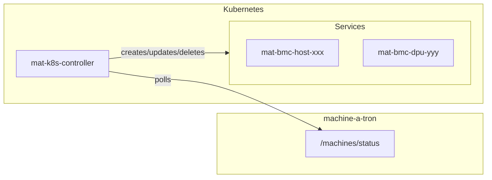

# Machine-a-tron Kubernetes Controller

A Kubernetes (K8s) controller that reconciles K8s services for Machine-a-tron (MAT) mock BMC endpoints.

## Overview

When Machine-a-tron runs in Kubernetes, mock BMCs need stable network exposure so that
NICo components can reach Redfish and IPMI/SOL endpoints.
This controller uses MAT machines status and reconciles one K8s service per mock BMC.

Machine-a-tron itself remains Kubernetes-agnostic. This controller bridges the gap.

## Features

- Polls machine-a-tron `GET /machines/status` API
- Creates one K8s service per mock BMC (hosts and DPUs)
- Exposes Redfish TCP (port 443 -> internal listen port)
- Exposes IPMI UDP when enabled (port 623 -> internal listen port)
- Labels and annotates K8s services with machine/BMC identity
- Updates K8s services when machine status changes
- Deletes stale K8s services when machines disappear
- Supports static ClusterIP assignment for predictable addressing

## Installation

### From Source

```bash
go build -o mat-k8s-controller ./cmd/mat-k8s-controller
```

### Docker

```bash
docker build -t mat-k8s-controller .
```

### Kubernetes

Deploy alongside Machine-a-tron using the Helm chart (coming soon).

## Configuration

The controller accepts configuration via flags or environment variables:

| Flag | Env Var | Default | Description |
|------|---------|---------|-------------|
| `--mat-url` | `MAT_URL` | `http://machine-a-tron:8080` | Machine-a-tron base URL |
| `--namespace` | `NAMESPACE` | `nico-mat` | Kubernetes namespace for services |
| `--sync-interval` | `SYNC_INTERVAL` | `30s` | Interval between reconciliation passes |
| `--kubeconfig` | `KUBECONFIG` | (in-cluster) | Path to kubeconfig file |
| `--target-selector` | `TARGET_SELECTOR` | `app=machine-a-tron` | Pod selector for services |
| `--cluster-ip-prefix` | `CLUSTER_IP_PREFIX` | (none) | Prefix for static ClusterIP |
| `--log-level` | `LOG_LEVEL` | `info` | Log level (debug, info, warn, error) |

### Static ClusterIP Assignment

When `--cluster-ip-prefix` is set and a BMC has an assigned IP, the controller will
assign a predictable ClusterIP using the last two octets of the BMC IP. For example:

- Prefix: `10.96`
- BMC IP: `172.20.0.20`
- ClusterIP: `10.96.0.20`

This enables predictable addressing for testing and development.

## Service Structure

Each created Service has:

### Labels

| Label | Description |
|-------|-------------|
| `app.kubernetes.io/managed-by` | Always `mat-k8s-controller` |
| `machine-a-tron.nvidia.com/mat-id` | Machine-a-tron internal UUID |
| `machine-a-tron.nvidia.com/machine-id` | NICo machine ID (if known) |
| `machine-a-tron.nvidia.com/machine-type` | `host` or `dpu` |
| `machine-a-tron.nvidia.com/parent-mat-id` | Parent host mat-id (DPUs only) |

### Annotations

| Annotation | Description |
|------------|-------------|
| `machine-a-tron.nvidia.com/bmc-ip` | BMC IP address |
| `machine-a-tron.nvidia.com/api-state` | Machine API state |
| `machine-a-tron.nvidia.com/power-state` | Machine power state |
| `machine-a-tron.nvidia.com/hardware-type` | Hardware type (e.g., GB200) |
| `machine-a-tron.nvidia.com/redfish-listen-port` | Internal Redfish listen port |
| `machine-a-tron.nvidia.com/ipmi-listen-port` | Internal IPMI listen port (if enabled) |

### Ports

| Name | Protocol | Port | Description |
|------|----------|------|-------------|
| `redfish` | TCP | 443 | Redfish API |
| `ipmi` | UDP | 623 | IPMI (if enabled) |

## Example

Given this machine-a-tron status:

```json
{
  "machines": [
    {
      "mat_id": "abc12345-...",
      "machine_id": "machine-001",
      "api_state": "Ready",
      "power_state": "On",
      "bmc": {
        "ip": "172.20.0.20",
        "redfish": {
          "reachable_port": 443,
          "listen_port": 8443
        }
      },
      "dpus": [
        {
          "mat_id": "def67890-...",
          "bmc": {
            "ip": "172.20.0.21",
            "redfish": {
              "reachable_port": 443,
              "listen_port": 8444
            }
          }
        }
      ]
    }
  ]
}
```

The controller creates two Services:

```yaml
apiVersion: v1
kind: Service
metadata:
  name: mat-bmc-host-abc12345
  labels:
    app.kubernetes.io/managed-by: mat-k8s-controller
    machine-a-tron.nvidia.com/mat-id: abc12345-...
    machine-a-tron.nvidia.com/machine-type: host
spec:
  type: ClusterIP
  selector:
    app: machine-a-tron
  ports:
  - name: redfish
    protocol: TCP
    port: 443
    targetPort: 8443
---
apiVersion: v1
kind: Service
metadata:
  name: mat-bmc-dpu-def67890
  labels:
    app.kubernetes.io/managed-by: mat-k8s-controller
    machine-a-tron.nvidia.com/mat-id: def67890-...
    machine-a-tron.nvidia.com/machine-type: dpu
    machine-a-tron.nvidia.com/parent-mat-id: abc12345-...
spec:
  type: ClusterIP
  selector:
    app: machine-a-tron
  ports:
  - name: redfish
    protocol: TCP
    port: 443
    targetPort: 8444
```

## Development

### Running Tests

```bash
go test ./...
```

### Running Locally

```bash
# With kubeconfig
./mat-k8s-controller --kubeconfig ~/.kube/config --mat-url http://localhost:8080

# In-cluster (when deployed as a pod)
./mat-k8s-controller
```

## Architecture



## Related

- [GitHub Issue #3380](https://github.com/NVIDIA/infra-controller/issues/3380) - Original feature request
- [GitHub Issue #3379](https://github.com/NVIDIA/infra-controller/issues/3379) - Machine-a-tron status API (prerequisite)
