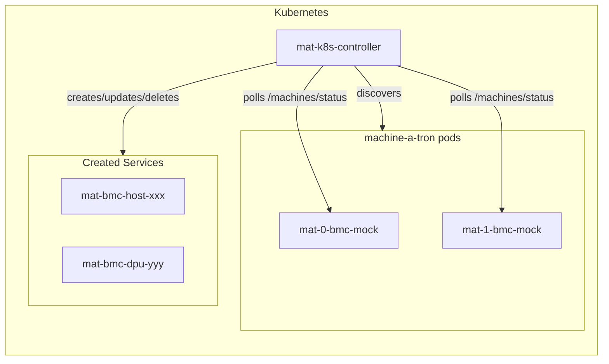

# Machine-a-tron Kubernetes Controller

A Kubernetes controller that auto-discovers machine-a-tron pods and creates Services for mock BMC endpoints.

## Overview

In multi-pod machine-a-tron deployments, each pod simulates different machines with unique BMC endpoints. This controller:

1. **Discovers** all machine-a-tron bmc-mock Services in the namespace
2. **Polls** each pod's `/machines/status` API
3. **Creates** one Kubernetes Service per BMC with:
   - Redfish TCP port (443 → internal listen port)
   - IPMI UDP port (623 → internal listen port) when enabled
4. **Updates** Services when machine status changes
5. **Deletes** stale Services when machines disappear

## Features

- **Auto-discovery**: Finds all machine-a-tron pods automatically
- **Multi-pod support**: Aggregates machines from all pods
- **Direct BMC IP as ClusterIP**: Services use BMC IP as ClusterIP (requires oobDhcpRelayAddress within K8s ServiceCIDR)
- **Automatic cleanup**: Removes Services for deleted machines

## Build

```bash
docker build -t mat-k8s-controller:latest .
kind load docker-image mat-k8s-controller:latest --name <cluster>
```

## Configuration

| Flag | Env Var | Default | Description |
|------|---------|---------|-------------|
| `--namespace` | `NAMESPACE` | `nico-system` | Namespace for Services and discovery |
| `--sync-interval` | `SYNC_INTERVAL` | `30s` | Reconciliation interval |
| `--target-selector` | `TARGET_SELECTOR` | `app.kubernetes.io/name=nico-machine-a-tron` | Pod selector for Services |
| `--bmc-mock-port` | `BMC_MOCK_PORT` | `1266` | BMC mock service port |
| `--insecure-skip-verify` | `INSECURE_SKIP_VERIFY` | `true` | Skip TLS verification |
| `--log-level` | `LOG_LEVEL` | `info` | Log level |

## Helm Deployment

Enable in your values:

```yaml
nico-machine-a-tron:
  mat-k8s-controller:
    enabled: true
    image:
      repository: mat-k8s-controller
      tag: latest
      pullPolicy: Never
    config:
      logLevel: debug
```

## Service Structure

Each created Service has:

**Labels:**
- `app.kubernetes.io/managed-by: mat-k8s-controller`
- `machine-a-tron.nvidia.com/mat-id: <uuid>`
- `machine-a-tron.nvidia.com/machine-type: host|dpu`

**Annotations:**
- `machine-a-tron.nvidia.com/bmc-ip: <ip>`
- `machine-a-tron.nvidia.com/api-state: <state>`
- `machine-a-tron.nvidia.com/power-state: <state>`

**Ports:**
- `redfish`: TCP 443 → targetPort (listen port)
- `ipmi`: UDP 623 → targetPort (listen port) - when IPMI enabled

## Troubleshooting

### No machine-a-tron instances discovered

Check that machine-a-tron pods have bmc-mock Services:

```bash
kubectl -n nico-system get svc -l app.kubernetes.io/name=nico-machine-a-tron
```

### ClusterIP already allocated

The BMC IP is already used by another Service. Options:

1. Reserve a ServiceCIDR for machine-a-tron (K8s 1.29+)
2. Use a different oobDhcpRelayAddress range
3. Delete conflicting Services

## Development

```bash
# Build
go build ./...

# Test
go test ./...

# Run locally
go run ./cmd/mat-k8s-controller --kubeconfig ~/.kube/config --log-level debug
```

## Architecture


