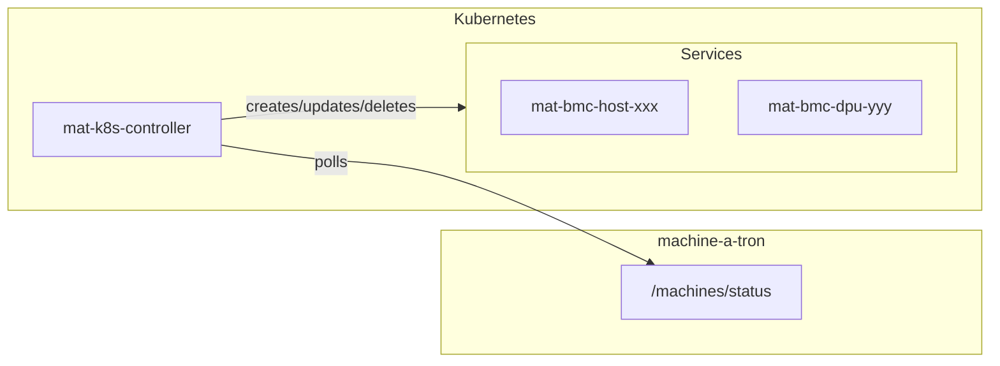

# Machine-a-tron Kubernetes Controller

A Kubernetes controller that reconciles Services for machine-a-tron mock BMC endpoints.

## Overview

When machine-a-tron runs in Kubernetes, mock BMCs need stable network exposure so that
NICo components can reach Redfish and IPMI/SOL endpoints.
This controller polls machine-a-tron status and reconciles one Service per mock BMC.

Machine-a-tron itself remains Kubernetes-agnostic. This controller bridges the gap.

## Features

- Polls machine-a-tron `GET /machines/status` API
- Creates one Service per mock BMC (hosts and DPUs)
- Exposes Redfish TCP (port 443 → internal listen port)
- Exposes IPMI UDP when enabled (port 623 → internal listen port)
- Uses BMC IP directly as Service ClusterIP
- Labels and annotates Services with machine/BMC identity
- Updates Services when machine status changes
- Deletes stale Services when machines disappear

## Build

```bash
# Build binary
go build -o mat-k8s-controller ./cmd/mat-k8s-controller

# Build container
docker build -t mat-k8s-controller:latest .

# Load to kind cluster
kind load docker-image mat-k8s-controller:latest --name <cluster>
```

## Configuration

| Flag | Env Var | Default | Description |
|------|---------|---------|-------------|
| `--mat-url` | `MAT_URL` | `https://nico-machine-a-tron-bmc-mock:1266` | Machine-a-tron base URL |
| `--namespace` | `NAMESPACE` | `nico-system` | Namespace for Services |
| `--sync-interval` | `SYNC_INTERVAL` | `30s` | Reconciliation interval |
| `--target-selector` | `TARGET_SELECTOR` | `app.kubernetes.io/name=nico-machine-a-tron` | Pod selector |
| `--insecure-skip-verify` | `INSECURE_SKIP_VERIFY` | `true` | Skip TLS verification |
| `--log-level` | `LOG_LEVEL` | `info` | Log level |

## ClusterIP Assignment

The controller uses BMC IP directly as Service ClusterIP. This requires machine-a-tron's
`oobDhcpRelayAddress` to be within the Kubernetes ServiceCIDR range.

### Setup

1. Configure machine-a-tron with `oobDhcpRelayAddress` from K8s ServiceCIDR:
   ```yaml
   pods:
     pod-0:
       machines:
         compute:
           oobDhcpRelayAddress: "10.100.0.1"  # Must be in K8s ServiceCIDR
   ```

2. Add the network to NICo configuration:
   ```toml
   [networks.MAT-BMC-SERVICES]
   type = "underlay"
   prefix = "10.100.0.0/20"
   ```

3. Result: BMC IP `10.100.0.5` → Service ClusterIP `10.100.0.5`

### CIDR Reservation (Recommended)

To avoid conflicts with other Services, reserve a CIDR range for machine-a-tron.
Kubernetes 1.29+ supports multiple ServiceCIDRs with the `MultiCIDRServiceAllocator`
feature gate:

```yaml
apiVersion: networking.k8s.io/v1beta1
kind: ServiceCIDR
metadata:
  name: machine-a-tron
spec:
  cidrs:
    - 10.100.0.0/16
```

## Helm Deployment

The controller is a subchart of `nico-machine-a-tron`. When enabled, it dynamically
manages BMC Services instead of static Helm-generated ones.

```bash
helm upgrade --install nico-machine-a-tron ./helm/charts/nico-machine-a-tron \
  --namespace nico-system \
  --create-namespace \
  --set mat-k8s-controller.enabled=true \
  --set mat-k8s-controller.image.pullPolicy=Never
```

Configuration is inherited from the parent chart:
- `matUrl` → derived from release name
- `namespace` → release namespace
- `targetSelector` → matches machine-a-tron pods

## Service Structure

Each Service has:

**Labels:**
- `app.kubernetes.io/managed-by: mat-k8s-controller`
- `machine-a-tron.nvidia.com/mat-id`
- `machine-a-tron.nvidia.com/machine-type` (host/dpu)

**Annotations:**
- `machine-a-tron.nvidia.com/bmc-ip`
- `machine-a-tron.nvidia.com/api-state`
- `machine-a-tron.nvidia.com/power-state`

**Ports:**
- `redfish` TCP 443 → targetPort (always)
- `ipmi` UDP 623 → targetPort (when IPMI enabled)

## Development

```bash
# Run tests
go test ./...

# Run locally
./mat-k8s-controller --kubeconfig ~/.kube/config --mat-url https://localhost:1266
```

## Troubleshooting

### ClusterIP already allocated

**Error:**
```
creating service mat-bmc-host-xxxxx: Service "mat-bmc-host-xxxxx" is invalid: 
spec.clusterIP: Invalid value: "10.100.0.5": provided IP is already allocated
```

**Cause:** Another Service is using the same ClusterIP. This happens when the
BMC IP range overlaps with Kubernetes' auto-allocated ClusterIPs.

**Solutions:**

1. **Reserve a ServiceCIDR** (Kubernetes 1.29+, recommended for production):
   ```yaml
   apiVersion: networking.k8s.io/v1beta1
   kind: ServiceCIDR
   metadata:
     name: machine-a-tron
   spec:
     cidrs:
       - 10.100.0.0/16
   ```

2. **Use a different CIDR range** in machine-a-tron `oobDhcpRelayAddress` that
   doesn't overlap with existing Services.

3. **Delete the conflicting Service** if it's no longer needed:
   ```bash
   kubectl get svc -A -o wide | grep 10.100.0.5
   kubectl delete svc <conflicting-service> -n <namespace>
   ```

**Impact:** The affected machine's BMC Service is not created. In NICo site-explorer,
the machine appears unhealthy until the conflict is resolved.

### BMC IP outside ServiceCIDR

**Error:**
```
creating service mat-bmc-host-xxxxx: Service "mat-bmc-host-xxxxx" is invalid:
spec.clusterIP: Invalid value: "192.168.100.5": provided IP is not in the valid range
```

**Cause:** Machine-a-tron's `oobDhcpRelayAddress` is not within Kubernetes ServiceCIDR.

**Solution:** Update `oobDhcpRelayAddress` to use IPs from K8s ServiceCIDR (default
`10.96.0.0/12` for kind/k3d clusters).

## Architecture



## Related

- [GitHub Issue #3380](https://github.com/NVIDIA/infra-controller/issues/3380) - Feature request
- [GitHub Issue #3379](https://github.com/NVIDIA/infra-controller/issues/3379) - Status API
